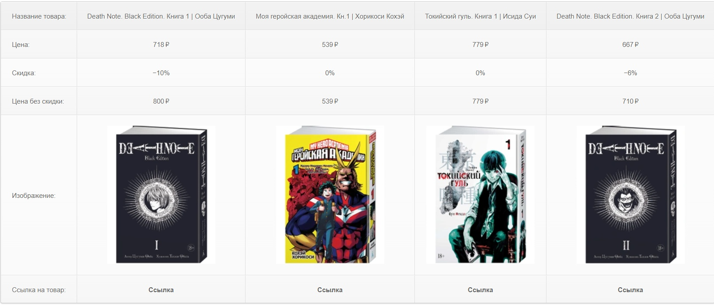

Что это и зачем?
--------------------------  

Это парсер товаров с магазина озон(ну как и видно по названию), функционал его очень мал, но возможно он будет расширяться в будущем. Создан он с целью показать мои умения в создании парсеров и показать мой подход к работе. Работает он очень просто. В index в форму вы вводите какой товар вам нужен и сколько. ВНИМАНИЕ! Значение принимается только от 1 до 4 ( так как после 4 ozon уже банит и не дает парсить дальше (для этого нужны прокси) ). После запроса идет перезагрузка страницы и все данные выводятся в табличку.

Табличка выглядит так:

   
